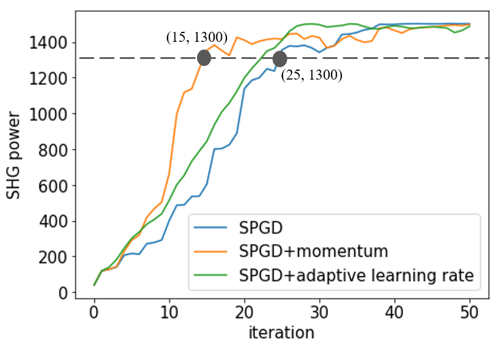

# Modified stochastic gradient algorithms for controlling coherent pulse stacking

Delay line coherent pulse stacking (CPS) is one of the promising methods to scale the peak power of the pulses. Simple few-channel delay line CPS is straightforward to set up in the lab, but controlling the feedback of the delay line is more complex.   
In this work, we open-source the delay line CPS simulation environment. Then we incorporate  Exponential Moving Average (EMA) techniques into SPGD to propose modified SPGD algorithms that converge faster than original SPGD in the field of controlling feedback in CPS. 

## Modified SG algorithms
The generic framework for stochastic gradient (SG) based algorithms.  

Momentum (EMA of gradient) mechanism + SPGD = SPGD with momentum.   
Adaptive learning rate method + SPGD = SPGD with adaptive learning rate.  

## Result
The convergence speed of SPGD with momentum (and SPGD with adaptive learning rate) is faster than the original one. 

